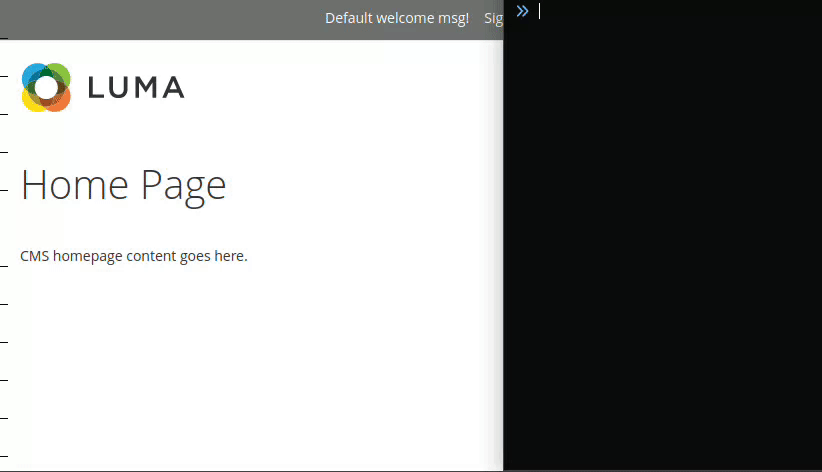

# Better Debug Hints

> Improved Magento 2 debug hints for layout and blocks



This module does not change any element styles or does not add any extra styles
for highlighting them, therefore **enabling hints does not affect website look,
feel nor behaviour.**

## Installation

```sh
composer require --dev kingfisherdirect/magento2-better-debug-hints
```

## Usage

Open your Magento page with an extra GET parameter `?ath=1`. For example:
`https://localhost/?ath=1`.

**Element Picker**

1. Press `` ` `` (backtick key, above tab)
2. Move your mouse on top of any html element
3. Click on it to get debug information in browser console
4. Right click on highlighted element to nagivate to it's direct parent
5. `ESC` to disable picker

**Console Helper**

Use `layout()` function to investigate any HTML element. To inspect currently selected element in inspector use `layout($0)`

## Credits

https://github.com/ho-nl/magento2-Ho_Templatehints

After starting work on this module I realised there is an existing one that seems quite good. Few ideas were taken out of that module.
